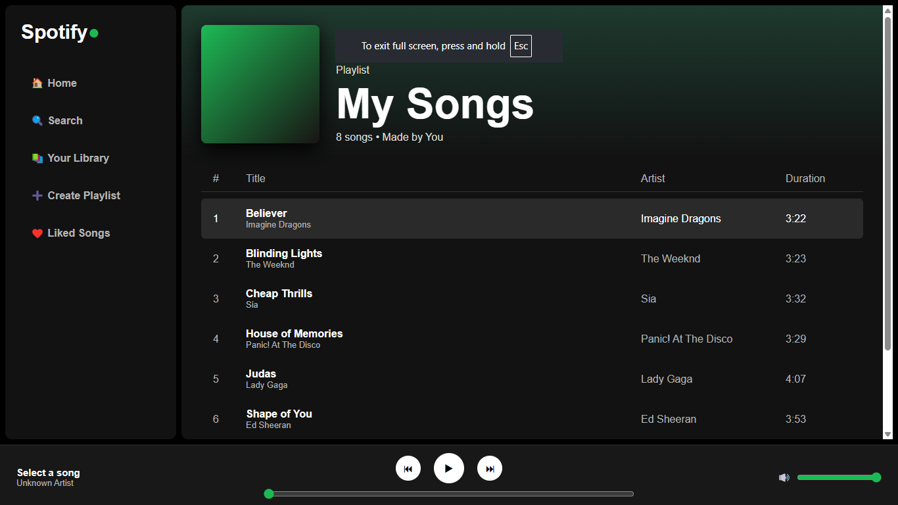

<div align="center">

<p align="center">
  
</p>

### A modern Spotify-inspired music streaming interface built using **HTML**, **CSS**, and **JavaScript**

<p>
  <a href="https://satyansh-yadav0812.github.io/spotify-web-clone/">
    
  </a>

  <a href="https://github.com/Satyansh-Yadav0812/spotify-web-clone">
    
  </a>
</p>

<p>
  
  
  
  
  
</p>

</div>

---

# 📖 About

**Spotify Web Clone** is a front-end recreation of Spotify's desktop music player. The project focuses on delivering a clean and responsive user interface while replicating the look and feel of Spotify's web application.

It was developed to strengthen my front-end development skills by working with modern layouts, responsive design principles, and JavaScript-powered music player interactions.

---

# 🌐 Live Demo

### 🚀 https://satyansh-yadav0812.github.io/spotify-web-clone/

---

# 📸 Project Preview

<p align="center">
  
</p>

---

# ✨ Features

- 🎵 Spotify-inspired modern interface
- 🎧 Interactive music player controls
- 📂 Playlist section
- 🎼 Song library with artist details
- ⏯️ Play & Pause functionality
- 📱 Responsive design
- ⚡ Smooth UI interactions
- 🎨 Clean dark theme

---

# 🛠️ Tech Stack

| Technology | Purpose |
|------------|----------|
| HTML5 | Structure |
| CSS3 | Styling & Layout |
| JavaScript | Interactivity |
| GitHub Pages | Deployment |

---

# 📂 Folder Structure

```text
spotify-web-clone/
│
├── assets/
│   └── images/
        └── preview.png
    └──spotify-title.svg
├── songs/
│
├── style.css
│
├── script.js
│
├── index.html
│
├── README.md
```

---

# 🚀 Getting Started

### Clone the repository

```bash
git clone https://github.com/Satyansh-Yadav0812/spotify-web-clone.git
```

### Navigate to the project folder

```bash
cd spotify-web-clone
```

### Run the project

Simply open **index.html** in your preferred web browser.

---

# 🧠 What I Learned

- Semantic HTML
- CSS Flexbox & Grid
- Responsive Web Design
- DOM Manipulation
- JavaScript Event Handling
- Audio Handling
- GitHub Pages Deployment
- Project Organization

---

# 🚀 Future Improvements

- [ ] Search functionality
- [ ] Shuffle mode
- [ ] Repeat mode
- [ ] Playlist creation
- [ ] Dynamic album covers
- [ ] Volume memory
- [ ] Theme switcher
- [ ] Better mobile optimization

---

# 👨‍💻 Author

### **Satyansh Yadav**

<p>
  <a href="https://github.com/Satyansh-Yadav0812">
    
  </a>

  <a href="mailto:satyansh.25b01011354@abes.ac.in">
    
  </a>
</p>

📧 **satyansh.25b01011354@abes.ac.in**

---

<div align="center">

## ⭐ If you found this project helpful, consider giving it a star!

Made with ❤️ by **Satyansh Yadav**

</div>
